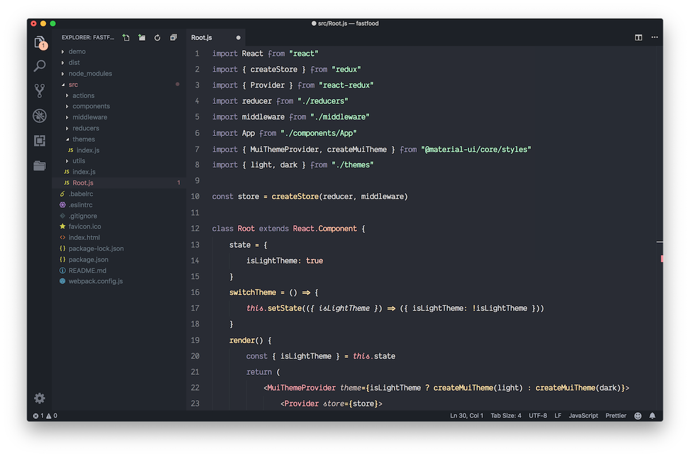
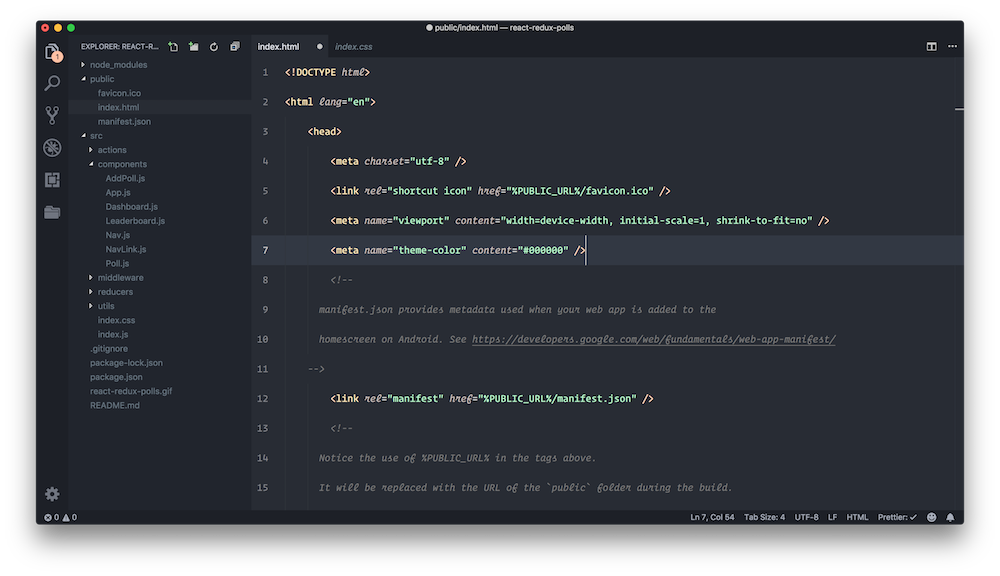
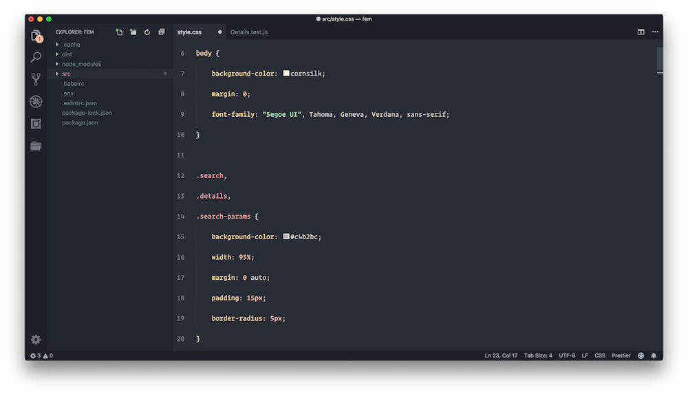
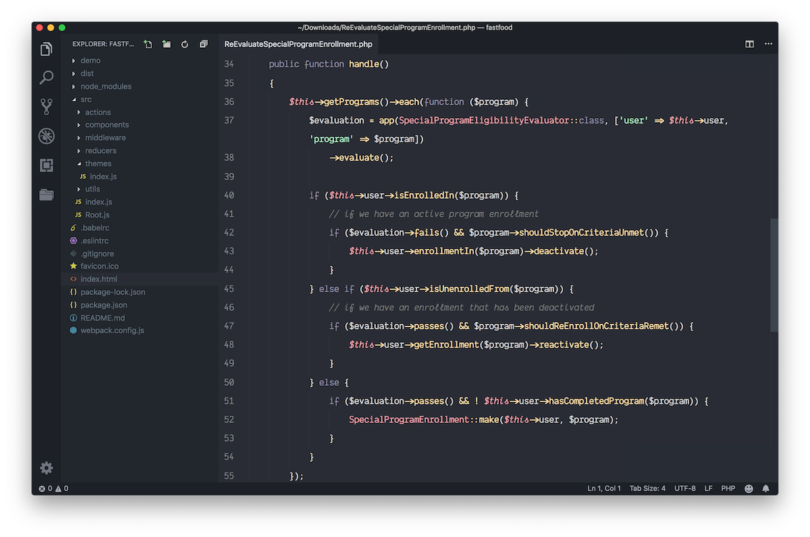

# Phantom 🏴

Dark and non-distractive VS Code theme. The minimal set of colors that we all wanted.

<div align="center">
	
	
	
	
</div>

# Installation

1.  Install [Visual Studio Code](https://code.visualstudio.com/).
2.  Launch VS Code.
3.  Choose **Preferences/Extensions** from menu.
4.  Search for `phantom code`.
5.  Click **Install** to install it.
6.  Click **Reload** to reload VS Code.
7.  Code > Preferences > Color Theme > **Phantom**

## Non Italic

If you hate italics, there is now a no-italic theme available (comments still will be italic). Select **Phantom Non Italic** as your color theme.

## Preferences shown in the preview

The font in the preview image is Operator Mono. Also looks great with Fira Code.
Icons: Monokai Classic Monochrome Icons

```
"workbench.editor.showIcons": false,
"editor.glyphMargin": false,
"editor.minimap.enabled": false,
"editor.renderLineHighlight": "all",
"editor.selectionHighlight": false,
"workbench.activityBar.visible": false,
```

### Inspiration

[Base16 Ocean Dark Theme Extended](https://marketplace.visualstudio.com/items?itemName=kleber-swf.ocean-dark-extended)
